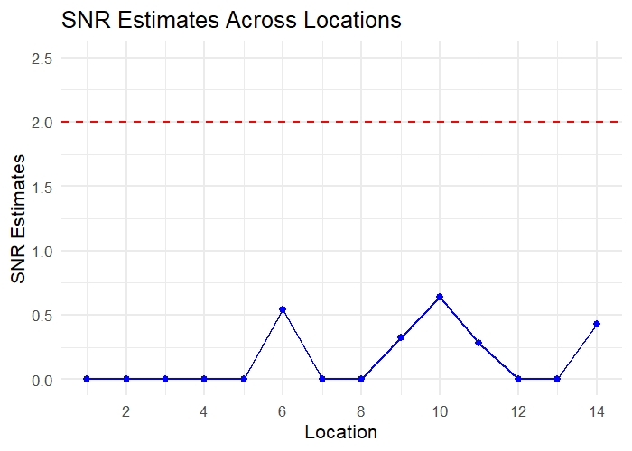

# Supplementary Case Study for A Measurement System Assessment Using Surface Texture Data

This repository contains an illustrative example of estimating variance components and signal-to-noise ratios (SNR) for surface texture measurements collected from additively manufactured parts. 

## 📄 Files
  - `case_study_msa_variance_estimation.R`: Step-by-step script using base R to reshape the data, estimate variance components and SNR for each location, and generate a plot of SNR estimates across locations.
  - `surface_data.csv`: Surface texture measurement dataset

    
## 🧾 Data Description

| Column     | Description                             |
|------------|---------------------------------------- |
| `day`      | Manufacturing cycle (Day 1-5)    |
| `sample`   | Printed item ID within a cycle (1–3)    |
| `location` | Measurement location on the item (1–14) |
| `sa`       | Arithmetic mean height of the surface   |
| `sz`       | Maximum height of the surface           |

Each day represents a new manufacturing cycle using the same setup and design. There are 3 printed items per cycle, all derived from the same design, and utilizing the exact setup on the manufacturing platform. The key surface characteristics used to measure roughness are the *arithmetic mean height* and *maximum height*. Measurements were taken at 14 consistent locations on each item. 

### 👁️ Data Preview
Below is a sample of the first few rows from 'surface_data.csv':

```txt
  day sample Location       sa       sz
   1      1        1 15.81418 150.9376
   1      1        2 16.23960 179.6778
   1      1        3 15.27695 138.7714
   1      1        4 19.83823 185.9456
   1      1        5 17.43414 166.5843
   1      1        6 17.41442 179.1234
```

## 🧮 Statistical Objective

The goal is to estimate:
- **Between-day variance component** ( represented as $\sigma^2_u$)
- **Within-day variance component** ($\sigma^2_e$)
- **Signal-to-noise ratio** (SNR). The maximum likelihood estimator of SNR is computed as:

$$
\widehat{\text{SNR}} = \sqrt{\max\left(0, \frac{1}{r} \left(\beta^{-1}\frac{MS_u}{MS_e} - 1 \right)\right)}
$$
  
where $r=3$, and $\beta = \frac{a}{a-1}$  for $a=5$ days.

## 📝 How to Run the Code
Set the working directory in the script to the folder containing `surface_data.csv`:

```txt
setwd("your/path/here")
```
##  📈 Plot

The SNR estimates for each location are visualized using `ggplot2`, with a dashed red reference line at an SNR of 2.



## 🔍 Observations
From the analysis, we observe the following:

- For both the **arithmetic mean height** (`sa`) and **maximum height** (`sz`) indicators, the estimated SNR exhibits spikes at specific locations, such as location **6**.
- For the `sa` values, the estimated SNR consistently remains **below 2** across all locations. This suggests that the **item's error** is the dominant source of variability in this measurement.
- However, for the `sz` values, the estimated SNR **reaches the cut-off value of 2** at one location. This indicates that at that specific location, **between-day variation** plays a more significant role.

## 📚 Reference 
- This illustrative example demonstrates the methods described in the following paper:

📄 *A Comprehensive Framework for Statistical Inference in Measurement System Assessment Studies* ([arXiv:2501.18037](https://arxiv.org/abs/2501.18037))

The scripts and analysis included here provide a simplified implementation of variance component estimation and signal-to-noise ratio (SNR) analysis, in line with the statistical modeling and inference approaches discussed in the paper.
If you use or adapt this example for research or teaching, please consider citing the paper.

- The dataset `surface_data.csv` is acquired from the *Multi-Scale Additive Manufacturing Lab*.

